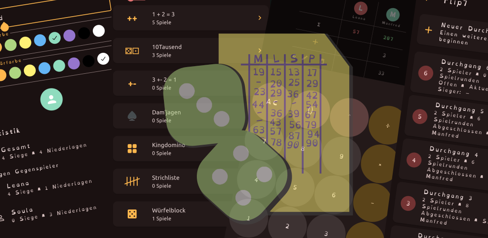

# PlaySheet

PlaySheet: Digitaler Spielblock / PlaySheet: Digital Scorepad

Ein digitaler Spielblock, der die Verwaltung von Spielständen und Statistiken für verschiedene Spiele ermöglicht. Spieler können ihre Ergebnisse speichern, neue Runden starten und verschiedene Spieloptionen anpassen. Spielstatistiken und Spielerprofile können erstellt und verwaltet werden.

## Spielstände

- [x] 1 + 2 = 3
- [x] 3 +- 2 = 1
- [x] 10Tausend
- [ ] Strichliste
- [ ] Dam'jagen
- [ ] Würfelblock
- [ ] Cluedo
- [ ] Kingdomino

## Spiele

- [ ] 4gewinnt
- [ ] Duotär

## Ideensammlung

- [ ] Käsekästchen (Spiel)
- [ ] TicTacToe (Spiel)
- [ ] Skat
- [ ] Schafkopf
- [ ] Doppelkopf
- [ ] Virtueller Würfel

## ToDo

- [x] Highlight-Fabe wie in VolleyAce verwenden! Aktuell ist Aktzent für Steuerelemente genutzt!
- [ ] Settings-Page angleichen mit VolleyAce (Vorschau und Speicherbutton in VolleyAce entfernen!)
- [x] Eingabe direkt live auf das Ergebnis (Summezeile) rechnen
- [ ] Geber markieren (neue Runde neuen Geber abfragen)
- [x] Spielerstatistik (Runden werden aktuell als Spiele gezählt)
- [x] Spieler in seiner Farbgebung darstellen (Anfangsbuchstabe in Kreis mit Spielerfarbe und darunter in sehr kleiner Schrift den Spielernamen)
- [-] Abgeschlossen muss wiedereröffent werden, wenn spiel gelöscht wird!
- [x] , entfernen und mit +-button für commit ersetzen
